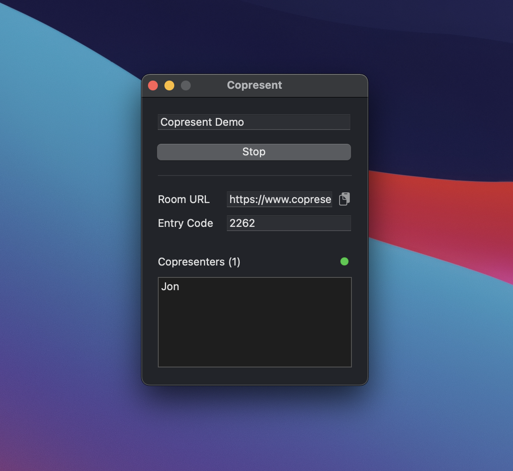
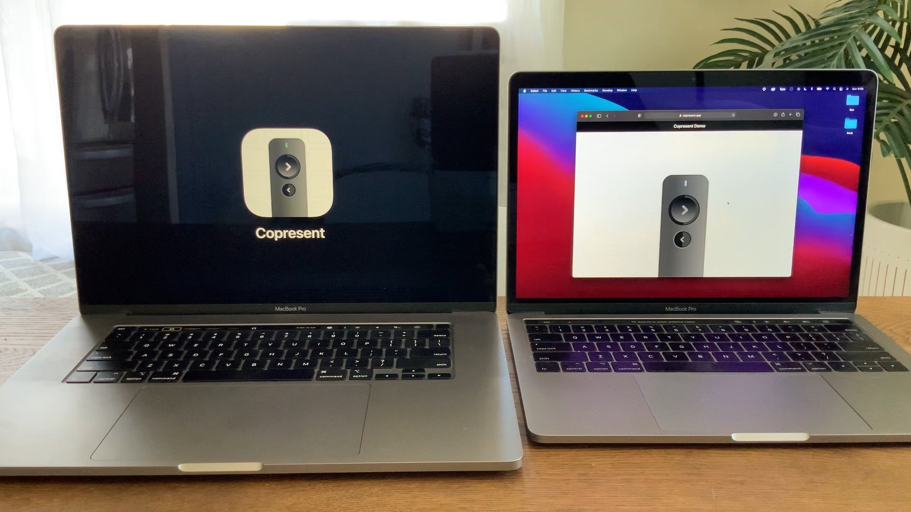

# Copresent
A macOS utility that ensures you never have to hear “Next slide, please” again.

## The Problem

"Next slide, please."

We've all been there. You're giving a remote presentation and it gets to a section that someone else is speaking to. But they're not in control of the Keynote, so they have to break rhythm (sometimes awkwardly) and ask you to go to the next slide.

With Copresent, you can quickly and easily give your fellow presenters full control of their own story.

## How it works

Copresent is deceptively simple. At its core is a macOS app that coordinates between socket requests and AppleScript to send "next" or "previous" commands to Keynote. A Nodejs server manages the creation of easily-sharable secure links and provides a web-based interface for controlling the presentation.

## Demo

[View on Vimeo](https://vimeo.com/517836596)
